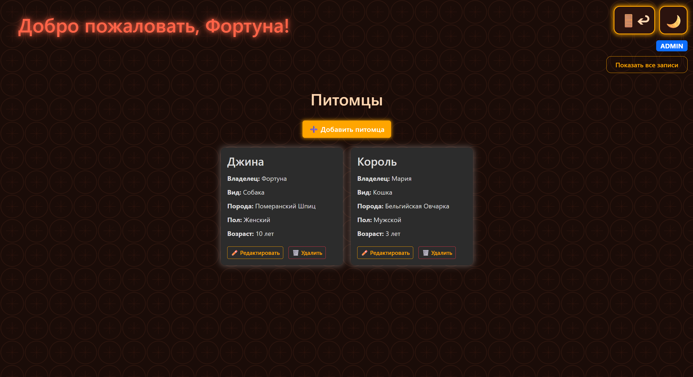
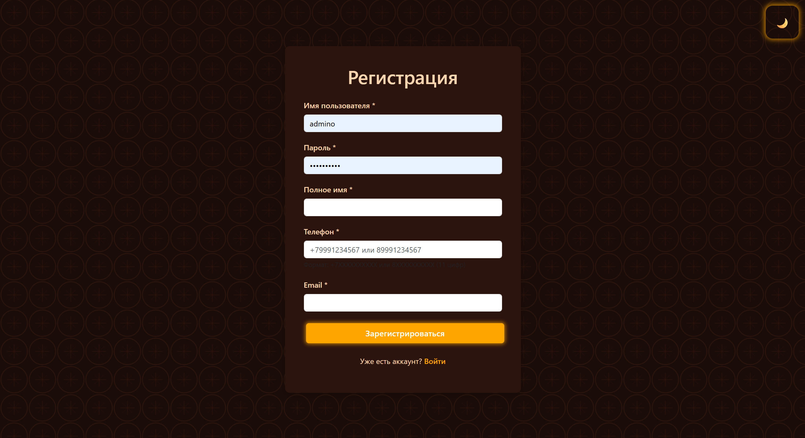
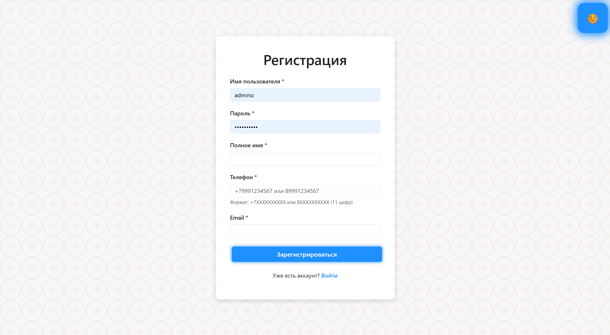
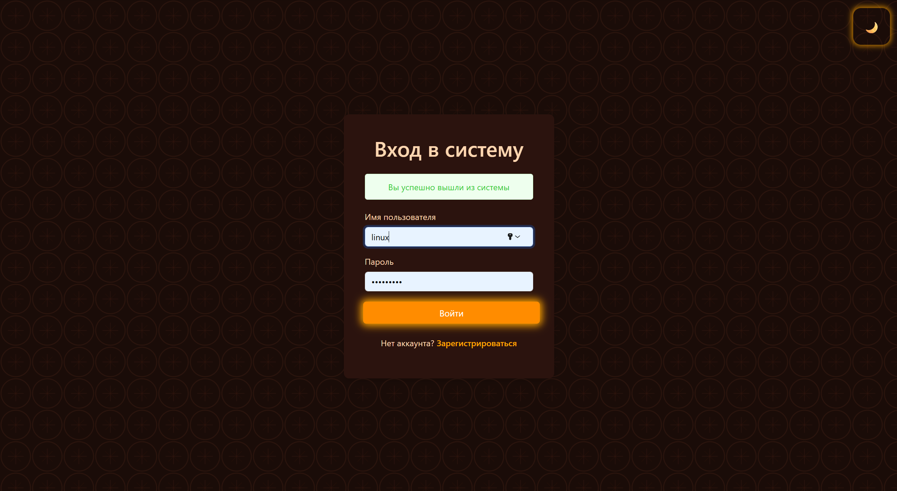
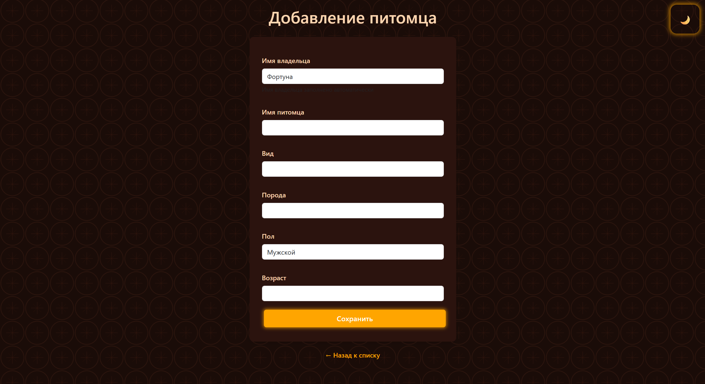

<h1 align="center">🐾 Spring Pets Web App</h1>

<p align="center">
  <em>Веб-приложение с регистрацией, авторизацией и системой управления записями с разграничением ролей (USER / ADMIN)</em>
</p>

<p align="center">
  
  
  
  
</p>

---

## 🌟 О проекте

Spring Boot веб-приложение с реализацией:

- 🔐 Регистрации и аутентификации пользователей
- 🛡 Ролевой модели доступа (USER / ADMIN)
- 📋 CRUD-операций над пользовательскими записями
- 🎨 Поддержки светлой и тёмной темы интерфейса

Пользователь управляет только своими данными,  
администратор имеет доступ ко всем записям.

Проект демонстрирует навыки backend-разработки с использованием Spring Security, JPA и PostgreSQL.

---

## 🏠 Главная страница пользователя

<figure align="center">
  
  <figcaption><em>Рис. 1 — Главная страница личного кабинета пользователя</em></figcaption>
</figure>

---

## 🚀 Функциональность

### 👤 Регистрация

- Проверка уникальности username
- Валидация номера телефона (формат РФ)
- Проверка минимальной длины пароля

<figure align="center">
  
  <figcaption><em>Рис. 2 — Форма регистрации пользователя</em></figcaption>
</figure>

---

<figure align="center">
  
  <figcaption><em>Рис. 3 — Светлая тема интерфейса</em></figcaption>
</figure>

---

### 🔐 Авторизация

- Защищённая аутентификация через Spring Security
- Разграничение прав доступа по ролям

<figure align="center">
  
  <figcaption><em>Рис. 4 — Страница входа в систему</em></figcaption>
</figure>

---

### 📂 Возможности пользователя

- Просмотр собственных записей
- Добавление новых записей
- Редактирование
- Удаление

<figure align="center">
  
  <figcaption><em>Рис. 5 — Форма добавления новой записи</em></figcaption>
</figure>

---

### 🛡 Возможности администратора

- Просмотр записей всех пользователей
- Редактирование любых записей
- Удаление записей

Ролевая модель реализована через Spring Security.

---

## 🛠 Технологии

- Java 17+
- Spring Boot
- Spring Security
- Spring Data JPA
- PostgreSQL
- Maven

---

## 📦 Установка и запуск

### 1️⃣ Клонирование репозитория

```bash
git clone https://github.com/xenonim-ctrl/spring-auth-crud-postgres.git
cd spring-auth-crud-postgres
```
### 2️⃣ Настройка базы данных
Создайте базу данных в PostgreSQL и обновите `application-local.properties`:
```bash
CREATE DATABASE name_db;
```
### 3️⃣ Запуск приложения
Windows:
```bash
mvnw.cmd spring-boot:run
```
Linux/Mac:
```bash
./mvnw spring-boot:run
```
Приложение будет доступно по адресу: `http://localhost:8080`
